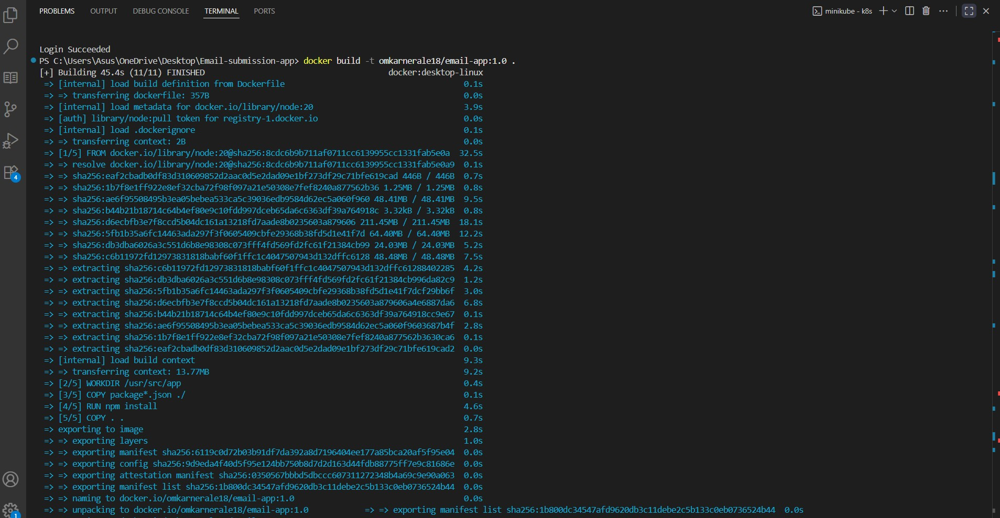
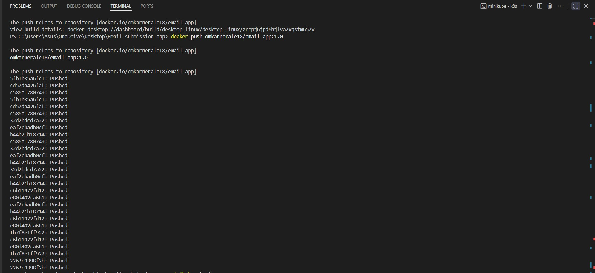
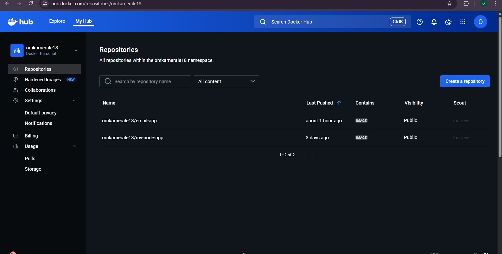
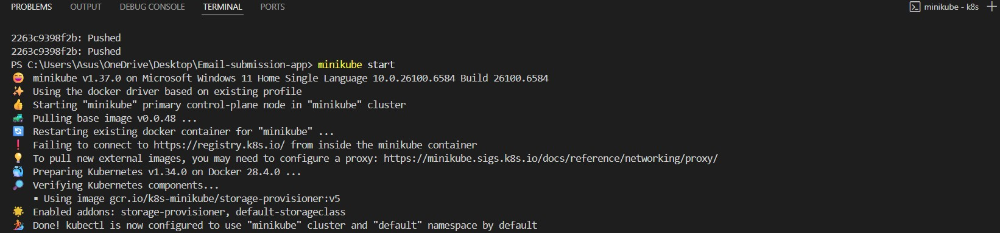
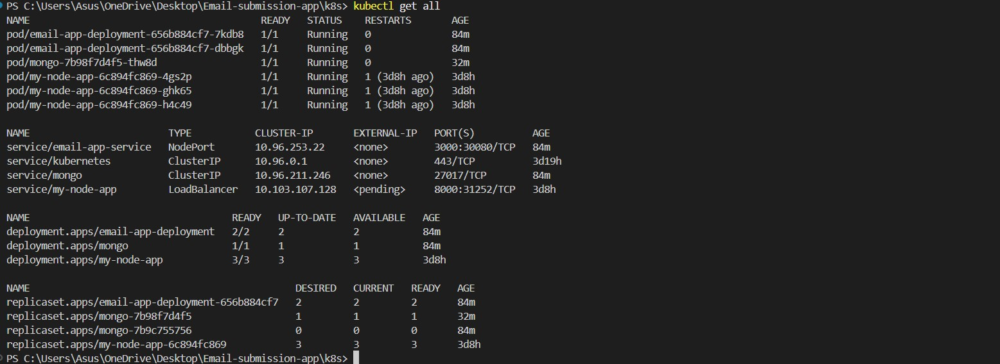
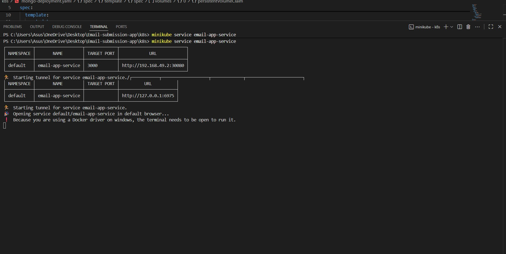
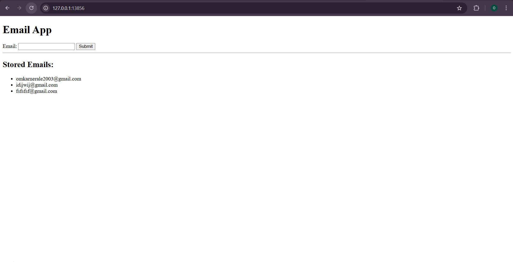

# 📧 Email Submission App on Kubernetes

This project is a **full-stack Email Submission Application** deployed on **Kubernetes**.  
It demonstrates how to containerize a Node.js app, integrate it with **MongoDB** for persistence, and expose the application using Kubernetes services.  
MongoDB Compass is used to visually inspect stored emails.

---

## 🚀 Features
- Node.js frontend for submitting emails
- MongoDB backend with PersistentVolumeClaim (PVC) for data persistence
- Kubernetes deployment manifests (`Deployment`, `Service`, `PVC`)
- Dockerized application pushed to Docker Hub
- Accessible via Minikube tunnel or NodePort
- Verified email storage in MongoDB Compass

---

## 🛠️ Tech Stack
- **Frontend/Backend:** Node.js, Express
- **Database:** MongoDB (with PVC for persistence)
- **Containerization:** Docker
- **Orchestration:** Kubernetes (Minikube)
- **Tools:** MongoDB Compass, Docker Hub
-  **YAML Manifests** for Deployment, Services, PVC

---

## ⚙️ Setup Instructions

### 1. Clone the repository
```bash
git clone https://github.com/<your-username>/k8s-Email-Submission-App.git
cd k8s-Email-Submission-App
```
### 2. Build and push Docker image
```bash
docker build -t <your-dockerhub-username>/email-app:1.0 .
docker push <your-dockerhub-username>/email-app:1.0
```
### 3. Deploy on Kubernetes
```bash
kubectl apply -f k8s/mongo-pvc.yaml
kubectl apply -f k8s/mongo-deployment.yaml
kubectl apply -f k8s/deployment.yaml
kubectl apply -f k8s/service.yaml

verify resources
kubectl get all
kubectl get pvc

```
### 4. Expose via Minikube
```bash
minikube service email-app-service
```
### 5. Access MongoDB in Compass
```bash
kubectl port-forward pod/<mongo-pod-name> 27017:27017
```
## 🖼️ Screenshots
### Building Docker Image 

### Pushing Docker Image To Dockerhub

### Docker Hub Image

### Starting Minikube

### K8s Resources running

### Accessed Via Minikube

### E-mail App Running


## 📖 Learning Points
- Using PersistentVolumeClaim to ensure MongoDB data survives pod restarts.
- Exposing services with NodePort / Minikube tunnel.
- Deploying containerized full-stack apps on Kubernetes
- Docker image management and registry usage

## 👨‍💻 Author
- Omkar Nerale
  DevOps Enthusiast 🚀

